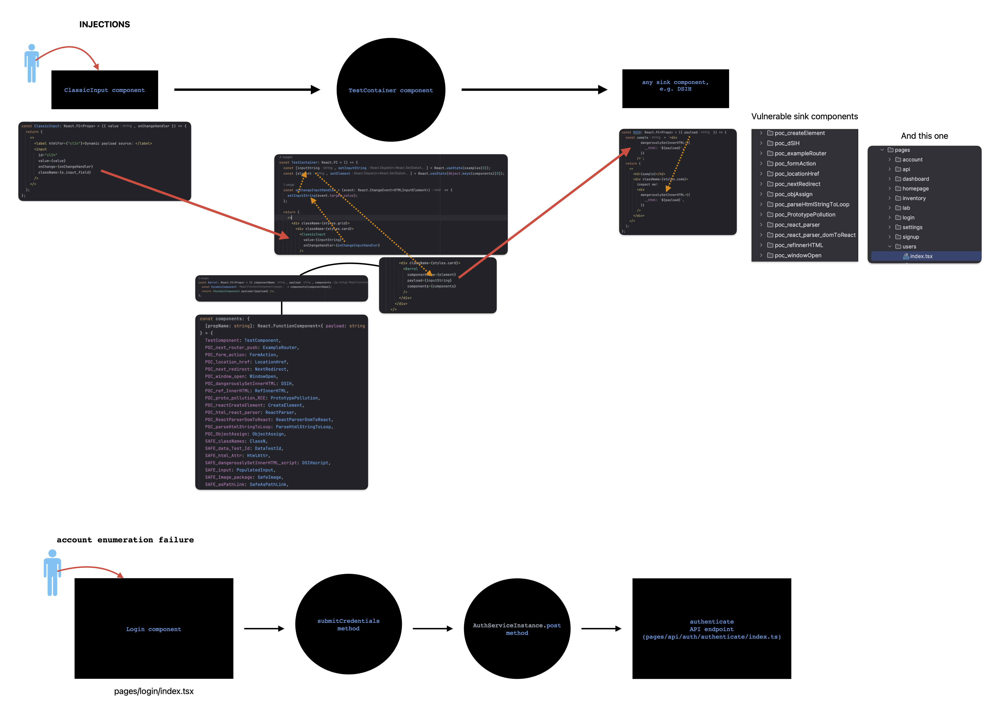

Welcome to MetroBook Store, highly vulnerable web application.

This application was intentionally impregnated with vulnerabilities and has a test bench to prove the concepts of
vulnerabilities in the React application.

The application uses React/Next/Typescript/MongoDB

Here is working web-version, deployed on Vercel https://metrobooks.vercel.app/

There are:

* 1 broken access control (A01:2021-Broken Access Control) [pages/account/index.tsx]
* 3 plain text secret tokens hardcoded (A02:2021-Cryptographic Failures) [data/constants.ts]
* 9 markup injections (A03:2021-Injection) [components/testLib]
* 5 business logic injections (A03:2021-Injection) [components/testLib]
* 5 DB injections (A03:
  2021-Injection) [pages/api/bio/index.ts, pages/api/auth/authenticate/index.ts, pages/api/inventory/, pages/api/signup/index.ts]
* 7 system information disclosure (A04:2021-Insecure
  Design ) [components/testLib/poc_PrototypePollution/PrototypePollution.tsx, pages/dashboard/index.tsx, components/testLib/safe_BaseService/BaseServiceComponent.tsx]
* 1 account enumeration failure (A05:2021-Security Misconfiguration ) [pages/login/index.tsx]
* 2 vulnerable components (A06:2021-Vulnerable and Outdated Components)
* 5 authorisation failures (A07:2021-Identification and Authentication
  Failures) [pages/api/bio/index.ts, pages/api/dashboard-data/index.ts, pages/api/inventory, pages/api/users/index.ts]
* 1 the session identifier in the URL exposure (A07:2021–Identification and Authentication
  Failures) [components/testLib/safe_BaseService/BaseServiceComponent.tsx:11]
* 1 Insecure deserialization of untrusted data & prototype pollution (A08:2021 – Software and Data Integrity
  Failures) [components/testLib/poc_PrototypePollution/PrototypePollution.tsx]
* 1 logging failure (A09:2021-Security Logging and Monitoring Failures)

Sample dataflow:

Future developments:

1. yaml with bad settings
2. ReactDOMServer.renderToStaticMarkup
3. vulnerable iframe
